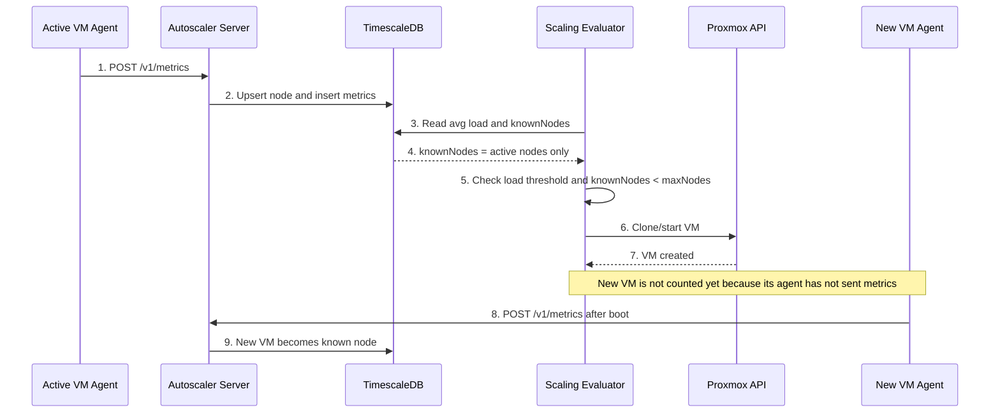
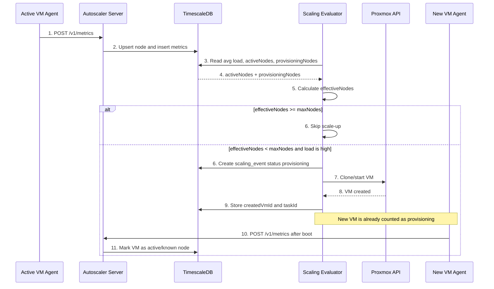

# pve-vm-autoscaler

[](https://github.com/dato-dev/pve-vm-autoscaler/actions/workflows/ci.yml)

`pve-vm-autoscaler` — MVP autoscaler для Proxmox. Агент запускается внутри flexible VM, отправляет CPU/RAM/disk метрики на сервер, сервер хранит временные ряды в TimescaleDB и создаёт новую VM через Proxmox API, если нагрузка держится выше заданного порога.

## Архитектура

### Текущая MVP-схема

В текущей реализации сервер считает только active-ноды, которые уже прислали хотя бы одну метрику. Новая VM начинает учитываться в `maxNodes` только после старта агента и первого успешного `POST /v1/metrics`.



Минус этой схемы: пока `New VM` не подняла агент и не отправила метрики, сервер её не видит как known node. Если нагрузка остаётся высокой и `cooldownSeconds` маленький, сервер может создать ещё одну VM до того, как первая новая VM появится в таблице `nodes`.

### Целевая схема



`maxNodes` должен ограничивать не только ноды, которые уже шлют метрики, но и VM в процессе provisioning. Иначе при долгом старте новой VM сервер может видеть только старые active nodes и создать лишние VM. Целевая модель: `effectiveNodes = activeNodes + provisioningNodes`. В текущем MVP `cooldownSeconds` снижает риск, но production-логика должна учитывать pending/provisioning scaling events как часть лимита.

## Компоненты

- `apps/agent`: сборщик CPU/RAM/disk метрик и push-клиент для `/v1/metrics`.
- `apps/server`: Fastify API, auth, миграции БД, evaluator и scaling events.
- `packages/shared`: Zod-схемы и TypeScript-типы для контрактов.
- `packages/proxmox`: клиент Proxmox API с dry-run, clone/start flow и polling task.
- `infra/policy.example.json`: пример scaling policy.

## Локальный запуск

1. Установить зависимости:

```bash
npm install
```

2. Скопировать env:

```bash
cp .env.example .env
```

3. Поднять TimescaleDB и сервер в dry-run режиме:

```bash
docker compose up --build
```

4. Запустить агента локально в отдельном терминале:

```bash
AGENT_TOKEN=change-me \
AGENT_SERVER_URL=http://localhost:8080 \
AGENT_LABELS=role=worker,env=dev \
npm run dev:agent
```

Сервер по умолчанию запускает миграции при старте. В dry-run режиме scaling event будет записан в БД, но VM в Proxmox создана не будет.

## Деплой: сервер локально, агент на CentOS/RHEL VM

Этот сценарий подходит, если твоя машина и тестовая VM находятся в одной LAN и VM может открыть `http://<your-lan-ip>:8080`.

1. На машине с сервером узнай LAN IP:

```bash
ipconfig getifaddr en0
```

Если используется не Wi-Fi интерфейс, проверь IP через `ifconfig` или системные настройки сети.

2. Подними сервер так, чтобы он слушал LAN:

```bash
cp .env.example .env
docker compose up --build
```

В `docker-compose.yml` сервер уже публикует `8080:8080`, а `SERVER_HOST` выставлен в `0.0.0.0`.

3. Проверь с VM, что сервер доступен:

```bash
curl http://<your-lan-ip>:8080/health
```

Ожидаемый ответ:

```json
{"ok":true,"service":"pve-vm-autoscaler-server"}
```

4. Скопируй проект на VM:

```bash
rsync -a --exclude node_modules --exclude dist ./ root@<vm-ip>:/tmp/pve-vm-autoscaler/
```

5. На VM установи агент как systemd service:

```bash
ssh root@<vm-ip>
cd /tmp/pve-vm-autoscaler
sudo AGENT_SERVER_URL=http://<your-lan-ip>:8080 \
  AGENT_TOKEN=change-me \
  AGENT_NODE_ID=test-vm-1 \
  AGENT_LABELS=role=worker,env=test \
  bash scripts/install-agent-rhel.sh
```

6. Проверь агент:

```bash
systemctl status pve-vm-autoscaler-agent --no-pager
journalctl -u pve-vm-autoscaler-agent -f
```

Если в логах агента есть `metrics sent`, сервер получает метрики. Если VM не достучалась до сервера, проверь firewall на машине с сервером и разреши входящий TCP `8080` в LAN.

## Конфигурация policy

Пример находится в `infra/policy.example.json`. Главные параметры:

- `evaluationWindowSeconds`: окно оценки, например `120` секунд.
- `thresholds.cpuPercent` и `thresholds.memoryPercent`: пороги scale-up.
- `cooldownSeconds`: пауза между scaling events по одной policy.
- `minNodes` и `maxNodes`: границы количества known nodes.
- `selector.labels`: какие агенты участвуют в policy.
- `proxmox`: target node, template VM ID, CPU/RAM/disk и стратегия clone.

## Proxmox

Для реального создания VM нужно выключить dry-run и задать токен:

```bash
PROXMOX_DRY_RUN=false
PROXMOX_BASE_URL=https://pve.example.com:8006
PROXMOX_TOKEN_ID=root@pam!autoscaler
PROXMOX_TOKEN_SECRET=...
```

Текущий MVP создаёт VM через clone template, применяет CPU/RAM/tags, при необходимости resize `virtio0`, запускает VM и ждёт завершения Proxmox task.

## Проверки

```bash
npm install
npm run build
npm test
npm run lint
```

Те же три шага выполняет CI на каждый push и pull request.

## Коммиты и релизы

Проект использует [Conventional Commits](https://www.conventionalcommits.org/) и semantic-release:
версия и `CHANGELOG.md` формируются из сообщений коммитов, вручную их править не нужно.

```
feat(policy): добавить поддержку YAML
fix(agent): считать память по MemAvailable
docs(readme): описать выбор источника метрик
```

`feat` поднимает minor, `fix` и `perf` — patch, остальные типы релиз не выпускают.
Формат проверяется локально git-хуком и в CI. Полная конвенция — в [CLAUDE.md](CLAUDE.md), п. 1.5.

После `npm install` активируется husky-хук, который проверит сообщение при `git commit`.
