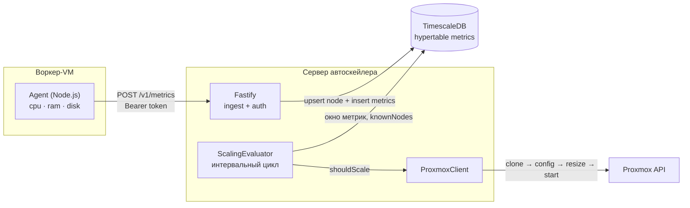
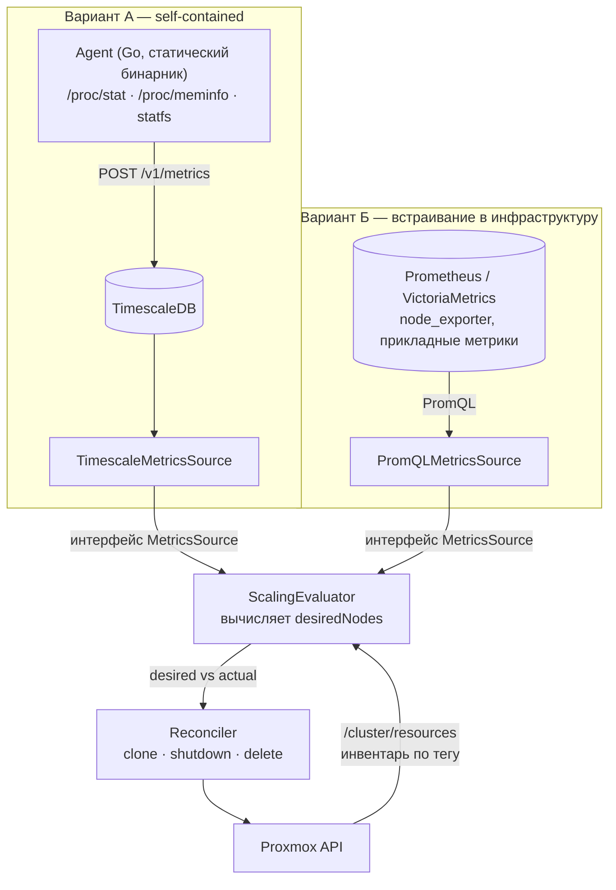

# ROADMAP — pve-vm-autoscaler

Дорожная карта проекта. Документ описывает **цели**, **текущее состояние** и **план развития**.
Обновляется при каждом значимом изменении функциональности (см. [CLAUDE.md](CLAUDE.md)).

---

## 1. Видение продукта

`pve-vm-autoscaler` — автоскейлер вычислительных нод для Proxmox VE.

**Цель:** дать on-premise инфраструктуре на Proxmox поведение, близкое к облачным auto scaling groups:
пул воркер-VM автоматически расширяется под нагрузкой и сжимается при её падении,
управляясь декларативной policy, без ручного вмешательства администратора.

**Уникальная ценность проекта — контур управления и жизненный цикл VM в Proxmox.**
Сбор и хранение метрик — решённая индустрией задача; проект не должен конкурировать
с Prometheus, а должен уметь брать данные оттуда (Milestone 5).

**Для кого.** Там, где нагрузка не контейнеризована и Kubernetes избыточен или неприменим:
legacy-приложения, Windows-нагрузки, требование изоляции на уровне VM, небольшой on-prem,
homelab, CI-раннеры на выделенных машинах. Если рабочая нагрузка уже в контейнерах —
cluster-autoscaler в Kubernetes или Nomad решат ту же задачу лучше, и это нормальный ответ.

**Не-цели (out of scope):**
- Не оркестратор контейнеров (это не Kubernetes cluster-autoscaler).
- Не система мониторинга общего назначения. Собственный агент и TimescaleDB —
  self-contained вариант для небольших инсталляций, а не цель развития.
- Не мультиоблако — целевой гипервизор один: Proxmox VE.
- Не балансировщик и не service mesh. Проект **публикует** состав пула, но не настраивает
  чужие балансировщики (ADR-4).

### 1.1 Что это на самом деле умеет

Если убрать частности, машина устроена так: **наблюдать сигнал → сравнить с декларативной
политикой → привести количество VM к нужному**. Автоскейлинг веб-фермы — лишь один частный
случай. Варьируются три вещи, и почти независимо друг от друга:

| Ось | Варианты |
|---|---|
| **Сигнал** | CPU/RAM/disk с агента, произвольный PromQL, длина очереди, расписание, отсутствие метрик |
| **Как работа попадает на ноду** | балансировщик (push) · очередь или job-раннер (pull) · никак |
| **Что делаем с VM** | добавить · убрать · заменить · пересоздать по новому шаблону |

**Ключевое следствие для приоритетов:** нагрузки, которые *сами забирают* работу — воркеры
очередей, CI-раннеры, — не нуждаются в балансировщике вообще. Для них весь пласт интеграции
с трафиком (ADR-4, Milestone 6) просто не нужен, и путь до законченного полезного сценария
у них кратно короче, чем у веб-фермы.

### 1.2 Сценарии применения

Отсортировано по отношению «польза / сколько ещё надо построить».

| # | Сценарий | Сигнал | Нужен LB? | Что не хватает |
|---|---|---|---|---|
| 1 | **CI-раннеры** (GitLab Runner, GitHub Actions self-hosted) | число задач в очереди | нет — раннер сам регистрируется | M5.7 (PromQL), M4 (scale-down) |
| 2 | **Воркеры очередей** (RabbitMQ, Kafka, SQS-подобные) | глубина очереди / lag | нет — воркер сам забирает | M5.7, M4 |
| 3 | **Плановая ёмкость** по расписанию | время суток / день недели | зависит от нагрузки | планировщик в политике |
| 4 | **Самолечение**: замена молчащих нод | `last_seen_at` вне окна | нет | почти ничего — детект уже есть (M1.3) |
| 5 | **Раскатка нового шаблона** (immutable infrastructure) | версия шаблона у VM | зависит | M4.3 drain + M4.4 delete |
| 6 | **Веб-ферма** за балансировщиком | CPU/RAM или RPS | **да** | M6 discovery + M4.3 drain |
| 7 | **Эфемерные окружения** под ветку или PR | вызов API, не метрика | нет | API создания по запросу |

**Сценарий 4 стоит особняком:** детект молчащих нод появился в M1.3 бесплатно, как побочный
эффект счётчика живых нод. До замены не хватает только правила «если нода молчит дольше X —
пересоздать», и нужен предохранитель от лавины пересозданий при сетевом сбое.

**Анти-сценарии.** Не пытаться масштабировать этим:
- **stateful-сервисы** — реплики БД, брокеры, всё с локальными данными и промоушеном ролей;
- **нагрузки с липкими сессиями** без поддержки drain — убьём активные сессии;
- **всё, где важна идентичность конкретной ноды** — этот проект считает ноды взаимозаменяемыми.

---

## 2. Архитектура

### Текущая



### Целевая (после Milestone 5 и 7)



**Компоненты:**

| Пакет | Назначение | Статус |
|---|---|---|
| `apps/agent` | Node-агент: сбор CPU/RAM/disk, push. | активен, депрекация в M7 |
| `apps/agent-go` | Go-агент: статический бинарник, `/proc` + `statfs`. | планируется, M7 |
| `apps/server` | Fastify API, auth, миграции, evaluator, scaling events. | активен |
| `packages/shared` | Zod-схемы контрактов + типы. Источник истины для кодогенерации Go. | активен |
| `packages/proxmox` | HTTP-клиент Proxmox API. | активен |
| `infra/` | Пример scaling policy, env-шаблон агента. | активен |
| `scripts/` | Установка агента как systemd-сервиса на RHEL/CentOS. | активен |

---

## 3. Текущее состояние (функционально MVP)

### Что работает

- [x] Агент собирает CPU (delta по `os.cpus()`), RAM (`MemAvailable` из `/proc/meminfo`), disk (`df -kP`).
- [x] Push метрик с экспоненциальным backoff при сбоях.
- [x] Ingest `POST /v1/metrics` с Bearer-токеном, валидация через Zod.
- [x] Хранение в TimescaleDB (hypertable `metrics`, таблицы `nodes`, `scaling_events`).
- [x] Evaluator: скользящее окно, пороги CPU/RAM/disk, cooldown, `minNodes`/`maxNodes`.
- [x] Селектор нод по labels (`selector.labels`).
- [x] Proxmox provisioning: clone из template → cores/memory/tags → resize диска → start → ожидание task.
- [x] Dry-run режим (`PROXMOX_DRY_RUN=true`).
- [x] Structured logging (pino через Fastify) на всех шагах решения и provisioning.
- [x] Docker Compose: TimescaleDB + сервер.
- [x] systemd-установщик агента для RHEL/CentOS.
- [x] Unit-тесты решения масштабирования (`decision.test.ts`).

### Известные ограничения

| # | Ограничение | Влияние | План |
|---|---|---|---|
| L1 | **Нет scale-down.** Ноды создаются, но никогда не удаляются. | Пул растёт до `maxNodes` и там остаётся. | M4 |
| L2 | **Provisioning-ноды не учитываются в `maxNodes`.** | При долгом старте VM и коротком cooldown создаются лишние VM. | M3 |
| ~~L3~~ | ~~**`countKnownNodes` не фильтрует по `last_seen_at`.**~~ Закрыто в M1.3. | — | ✅ |
| ~~L4~~ | ~~**`countKnownNodes` тянет всю таблицу `nodes` в память.**~~ Закрыто в M1.3. | — | ✅ |
| ~~L5~~ | ~~**Транзакция в `saveMetric` через `pool.query("BEGIN")`.**~~ Закрыто в M1.2. | — | ✅ |
| L6 | **Один статический общий токен на все агенты.** Сравнение стало constant-time в M1.4, но токен по-прежнему один. | Компрометация одного агента = компрометация всех; нет отзыва и ротации. | M8.1 |
| ~~L7~~ | ~~**Секрет Proxmox в `docker-compose.yml`.**~~ Устранено в M1.1 до первого коммита. | В git-историю не попало. Остаётся ротация токена. | M1.1a |
| L8 | **Нет retention/compression** на hypertable `metrics`. | Неограниченный рост БД. | M6.4 |
| L9 | **Нет API чтения** — только `/health` и `/v1/metrics`. | Нельзя посмотреть ноды/события без SQL. | M6.1 |
| L10 | **Диск при resize захардкожен как `virtio0`.** | Не работает для `scsi0`/`sata0` шаблонов. | M2.10 |
| ~~L11~~ | ~~**Один тест-файл.**~~ Закрыто в M1.6: покрыты decision, repository, auth-хук и роут. | — | ✅ |
| ~~L12~~ | ~~**Нет CI, нет git-репозитория**, нет версионирования и CHANGELOG.~~ Закрыто в M1.7. | — | ✅ |
| ~~L13~~ | ~~**Агент меряет RAM через `os.freemem()` = `MemFree`.**~~ Закрыто в M1.8. | — | ✅ |
| ~~L14~~ | ~~**`avg()` считается по строкам, а не по нодам.**~~ Закрыто в M1.9. | — | ✅ |
| ~~L15~~ | ~~**Отказ ноды снижает нагрузку и сохраняет счётчик нод.**~~ Закрыто в M1.3: порог свежести счётчика равен окну усреднения. | — | ✅ |
| L16 | **Решение булево, а не «целевое количество».** Одна VM за один cooldown. | Нагрузку, требующую 5 нод, пул набирает за 5 периодов cooldown. | ADR-2 |
| L17 | **Provisioning блокирует цикл оценки** (`await createNode` до 120 с внутри `evaluateOnce`). | Head-of-line blocking: медленный клон в одной policy останавливает все остальные. | M3.6 |
| L18 | **TOCTOU между `getNextVmId` и `clone`.** | Гонка с веб-интерфейсом Proxmox или вторым инстансом сервера → clone падает. | M3.7 |
| L19 | **`raw jsonb` дублирует каждую метрику целиком** рядом с разобранными колонками. | Удвоение объёма БД ради данных, к которым нет запросов. | M6.5 |
| L20 | **Node-агент тащит рантайм на каждую воркер-VM** (~40–60 МБ RSS) и шеллится в `df`. | Накладные расходы и хрупкий парсинг вывода. | M7 |
| L21 | **Метрики жёстко привязаны к собственному пайплайну.** Нельзя использовать существующий Prometheus. | Проект переизобретает Prometheus; не встраивается в готовую инфраструктуру. | M5 |
| L22 | **`sampleIntervalSeconds` объявлен в схеме и лежит в примере, но не читается кодом.** Проверено: единственные вхождения — `packages/shared/src/index.ts:36` и сам пример. | Пользователь настраивает поле, которое ни на что не влияет. | M2.7 |
| L23 | **Policy в JSON: комментарии невозможны.** В одном объекте смешаны тюнинг (пороги, окна) и шаблон машины (`templateVmId`, cores, memory, storage); шаблон нельзя переиспользовать между политиками. | Оператор не может зафиксировать «почему такой порог»; правка порога идёт в файле с проксмоксовой сантехникой; дублирование при нескольких пулах. | M2 |
| L24 | **Термин «node» означает две разные сущности.** `proxmox.targetNode` — гипервизор, `minNodes`/`maxNodes` — воркер-VM. | Систематическая путаница при первом чтении политики. | M2.8 |
| L25 | **Пример политики содержит отладочные значения**: `evaluationWindowSeconds: 5`, `cooldownSeconds: 10`. | Любой, кто скопирует пример как основу, получит флаппинг. | M2.14 |
| ~~L26~~ | ~~**Зависимости как `"latest"`, нет `package-lock.json`.**~~ Закрыто в M1.10 и M1.10a. | — | ✅ |

---

## 4. План развития

> **Версии milestone'ам не назначаются.** Их считает semantic-release из сообщений коммитов
> (конвенция — [CLAUDE.md](CLAUDE.md), п. 1.5); `version` в `package.json` руками не правится.
> Раньше здесь стояли целевые номера версий — они убраны, потому что фактическая версия
> зависит от того, что реально попало в коммиты, и расходилась с планом.
>
> Проект прошёл `1.0.0`, поэтому semver действует в полную силу: `feat` → minor,
> `fix` и `perf` → patch, а футер `BREAKING CHANGE:` теперь поднимает **мажор**
> (до `1.0.0` он давал лишь minor). Milestone'ы с пометкой ⚠️ ломают совместимость:
> M2 меняет формат политики, M7 удаляет Node-агента.
>
> Как проект оказался на `1.0.0`: 2026-07-26 фраза `BREAKING CHANGE` из описания правила
> попала в начало строки в теле `docs`-коммита, и парсер принял её за футер. Ломающих
> изменений в том релизе не было. Опубликованную историю решено не переписывать.

### Milestone 1 — Безопасность и корректность 🔴 приоритет

Цель: сделать текущий MVP пригодным к реальному запуску без риска потери данных,
утечки доступов и ложных решений.

- [x] **M1.1** Убрать Proxmox-секрет из `docker-compose.yml` — значения читаются из `.env`
      через `${VAR}`, `PROXMOX_DRY_RUN` по умолчанию `true`. Сделано до первого коммита,
      поэтому в git-историю секрет не попал. *(L7)*
- [ ] **M1.1a** ⚠️ **Действие вне репозитория:** ротировать токен Proxmox, который лежал
      в `docker-compose.yml` в открытом виде. Файл в git не публиковался, но лежал в открытом виде
      в `~/Documents` — если каталог синхронизируется в облако или попадает в бэкапы,
      считать токен скомпрометированным. Отзыв: Datacenter → Permissions → API Tokens.
- [x] **M1.2** Починить транзакцию в `saveMetric`: `pool.connect()` → `client.query` → `client.release()`
      в `finally`. Ошибка самого `ROLLBACK` глотается, чтобы не подменять причину сбоя.
      Тесты на фейковом пуле проверяют, что все запросы транзакции идут по одному
      соединению и что оно возвращается в пул на любом пути. *(L5)*
- [x] **M1.3** `countKnownNodes` переписан на SQL с `labels @> $1::jsonb` (использует GIN-индекс
      `nodes_labels_idx`) и фильтром `last_seen_at >= now() - interval`. *(L3, L4, L15)*

      **Отклонение от исходного плана:** поле `nodeStaleAfterSeconds` в policy **не добавлялось** —
      это нарушило бы правило «не расширять текущую JSON-схему до M2» (иначе двойная миграция).
      Порог свежести берётся равным `evaluationWindowSeconds`. Так даже точнее по смыслу:
      нода, выпавшая из окна усреднения, перестаёт влиять на средние — значит и место
      в лимите `maxNodes` занимать не должна. Именно рассогласование этих двух счётчиков
      и составляло L15. Явный knob (`staleAfter: 5m`) появится в M2 вместе с duration-строками.
- [x] **M1.4** Constant-time сравнение токена и `return reply` в auth-хуке. *(L6)*

      **Найдено при реализации:** отсутствие `return` было не стилистикой, а дырой.
      В асинхронных хуках Fastify ответ без возврата `reply` не обрывает жизненный цикл —
      обработчик маршрута выполнялся, и неаутентифицированный запрос **писал метрики в базу**.
      Клиент видел 401 лишь потому, что ответ уже был отправлен.
      Сравниваются SHA-256 дайджесты: `timingSafeEqual` падает на буферах разной длины,
      что само по себе побочный канал.
- [x] **M1.5** `safeParse` вместо `parse`: невалидный payload → `400` с путями до полей
      вместо `500`. По `500` агент уходил в backoff и бесконечно ретраил заведомо битые данные.
- [x] **M1.6** Тесты: repository (фейковый пул, M1.2/M1.3), auth-хук, роут `/v1/metrics`
      через `app.inject()`. В каждом отказном сценарии отдельно проверяется, что запрос
      не дошёл до записи в БД. *(L11)*
- [x] **M1.7** Git-репозиторий + CI + semantic-release. *(L12)*
      `.github/workflows/ci.yml`: три job'а — `verify` (build / test / lint),
      `commitlint` (формат сообщений на push и PR), `release` (только push в `main`,
      после зелёных проверок). `commitlint.config.js` синхронизирован с [CLAUDE.md](CLAUDE.md), п. 1.5;
      husky-хук `commit-msg` ловит формат локально. Тег `v0.1.0` проставлен на начальный импорт,
      чтобы semantic-release считал версии от него, а не начинал с `1.0.0`.
      Попутно исправлен `eslint.config.js`: `ignores` в одном объекте с `rules` не работал
      как глобальный игнор, и `lint` после `build` пошёл бы по `dist/**`.
      В CI выставлен `HUSKY=0`, а `chore(release):` внесён в `ignores` commitlint —
      иначе хук `commit-msg` блокирует коммит, который semantic-release делает сам
      (в теле сгенерированные release notes длиннее `body-max-line-length`).
- [x] **M1.10** Все зависимости переведены с `"latest"` на caret-диапазоны, межпакетные
      ссылки внутри workspace — на `*` (раньше жёстко `0.1.0`, и любой сдвиг версии пакета
      ломал бы резолв). Добавлено `engines.node >= 20`. Установка в CI вынесена
      в `.github/install-deps.sh`: он использует `npm ci` при наличии лока и откатывается
      на `npm install` с предупреждением в Actions, пока лока нет. *(L26)*
- [x] **M1.10a** `package-lock.json` сгенерирован и закоммичен (811 пакетов, lockfileVersion 3).
      `npm` в окружении агента нет, поэтому установка выполнялась в контейнере `node:22`
      с примонтированным каталогом проекта. `install-deps.sh` теперь берёт ветку `npm ci`,
      в обоих `setup-node` включён `cache: npm`.
- [x] **M1.8** RAM считается по `MemAvailable` из `/proc/meminfo`. Разбор вынесен
      в чистые `parseMemInfo` и `toMemoryUsage` — тесты не трогают файловую систему.
      Fallback на `os.totalmem`/`os.freemem` остаётся для не-Linux, урезанных контейнеров
      и ядер старше 3.14. Процент ограничен диапазоном 0..100, иначе Zod-схема на сервере
      отвергла бы снимок целиком. *(L13)*
- [x] **M1.9** Агрегация стала двухуровневой: CTE `per_node` считает среднее по каждой ноде,
      внешний запрос — среднее по нодам. Выбор статистики зафиксирован в JSDoc:
      среднее по нодам корректно для однородного пула, но прячет перекос —
      альтернативы (доля нод выше порога, p95) в бэклоге и требуют изменения формы политики. *(L14)*

**DoD:** `npm run build && npm test && npm run lint` зелёные в CI; секретов в репозитории нет;
на idle-машине с прогретым page cache `memoryPercent` не завышен.

---

### Milestone 2 — Формат и структура политик ⚠️ ломающее

Цель: сделать policy файлом, который оператор редактирует и понимает без чтения исходников. *(L10, L22–L25)*

**Почему сейчас, а не потом.** Это ломающее изменение конфигурации. Сегодня у проекта ноль пользователей
и ноль политик в проде — цена перехода равна написанию конвертера. Каждый следующий milestone добавляет
в политику поля (scale-down в M4, настройки PromQL в M5), поэтому менять форму нужно **до** них,
иначе придётся мигрировать дважды.

**Формат: YAML.** Решающий аргумент — комментарии. Policy тюнят регулярно, и «почему здесь такой порог»
должно жить рядом со значением, а не в чьей-то голове. Дополнительно: `---` для нескольких политик,
отсутствие ошибок с висящей запятой, привычность для админов Proxmox (Ansible).

- [ ] **M2.1** Перейти на YAML. Парсер — **`yaml` (eemeli, YAML 1.2)**, не `js-yaml` с дефолтной схемой:
      в YAML 1.1 значения `no`/`off`/`yes`/`on` становятся булевыми, а `selector` содержит
      произвольные пользовательские метки (`env: no` сломает `z.record(z.string(), z.string())`).
      Поддержать `.yaml`/`.yml`.
- [ ] **M2.2** Разделить `nodeTemplates` (**что** создавать — меняется редко) и `policies`
      (**когда** масштабировать — тюнится постоянно). Policy ссылается на шаблон по имени,
      один шаблон переиспользуется несколькими политиками. *(L23)*
- [ ] **M2.3** Поле `version: 1` в корне — точка расширения для будущих миграций формата.
- [ ] **M2.4** Duration-строки: `window: 2m`, `cooldown: 5m` вместо `*Seconds`.
      Zod `.transform()` + парсер; голое число принимается как секунды.
- [ ] **M2.5** Quantity-строки: `memory: 2Gi`, `disk: 20Gi` вместо `memoryMb` / `diskGb`.
- [ ] **M2.6** Проценты явно: `cpu: 60%`. Снимает двусмысленность с `cpu: 2` (ядра) в шаблоне машины.
- [ ] **M2.7** Убрать мёртвое поле `sampleIntervalSeconds`. *(L22)*
- [ ] **M2.8** Переименования против терминологического конфликта: `proxmox.targetNode` → `hypervisor`,
      `minNodes`/`maxNodes` → `nodes.min`/`nodes.max`, плоский `selector` вместо `selector.labels`. *(L24)*
- [ ] **M2.9** Пороги сгруппировать в `scaleUp` (и `scaleDown` — заготовка под M4),
      cooldown переезжает внутрь соответствующей группы.
- [ ] **M2.10** `diskDevice` в шаблоне машины вместо захардкоженного `virtio0`. *(L10)*
- [ ] **M2.11** Человеко-читаемые ошибки валидации: путь до поля, полученное и ожидаемое значение
      вместо сырого `ZodError` в stderr.
- [ ] **M2.12** CLI `pve-vm-autoscaler validate <file>` — проверка политики без запуска сервера и БД.
- [ ] **M2.13** Одноразовый конвертер старого JSON → новый YAML.
- [ ] **M2.14** Новый `infra/policy.example.yaml` с **продакшн-адекватными** значениями и комментариями;
      старый пример с отладочными 5s/10s удалить. *(L25)*
- [ ] **M2.15** Тесты: парсеры duration / quantity / percent на граничных значениях,
      разрешение ссылки на `nodeTemplate` (включая ссылку на несуществующий),
      битый YAML → внятная ошибка, golden-тест конвертера, регресс на `env: no` в метках.

**Целевая форма:**

```yaml
version: 1

# Что создавать. Меняется редко, переиспользуется политиками.
nodeTemplates:
  worker:
    hypervisor: proxmox          # нода Proxmox, а не воркер
    templateVmId: 100
    namePrefix: autoscaled-worker
    cpu: 2                       # ядра
    memory: 2Gi
    disk: 20Gi
    diskDevice: virtio0
    linkedClone: true
    tags: [pve-vm-autoscaler, worker]

# Когда масштабировать. Это то, что тюнят.
policies:
  - name: default-workers
    template: worker
    selector:
      role: worker

    nodes: { min: 1, max: 5 }

    # Окно должно быть заметно больше интервала отправки метрик агентом,
    # иначе решение принимается по одному-двум сэмплам.
    window: 2m

    scaleUp:
      cpu: 60%                   # % — не путать с cpu: 2 в шаблоне машины
      memory: 80%
      cooldown: 5m

    scaleDown:                   # появится в M4
      cpu: 20%
      cooldown: 10m              # вниз осторожнее, чем вверх
```

**DoD:** политику можно отредактировать и понять без чтения исходников; `validate` ловит ошибки
до старта сервера; один `nodeTemplate` обслуживает несколько политик; в примере нет значений,
вызывающих флаппинг.

---

### Milestone 3 — Учёт provisioning и корректный лимит

Цель: реализовать целевую схему из README — `effectiveNodes = activeNodes + provisioningNodes`.

- [ ] **M3.1** Статус `provisioning` в `scaling_events` + `expires_at` (TTL на «зависшие» события).
- [ ] **M3.2** `countProvisioningNodes(policyId)` — события `pending`/`running`/`provisioning`
      не старше `provisioningTimeout`.
- [ ] **M3.3** `evaluateScalingDecision` принимает `effectiveNodes` вместо `knownNodes`;
      обновить сигнатуру и тесты.
- [ ] **M3.4** Reconciler: связывание созданной VM с появившейся нодой (по имени/тегу/vmId),
      перевод события в `succeeded` или `failed` по таймауту.
- [ ] **M3.5** Тесты на race: высокая нагрузка + медленный старт VM не должны давать перескейл.
- [ ] **M3.6** Вынести provisioning из цикла оценки в отдельный воркер: evaluator пишет намерение,
      воркер исполняет и поллит task. *(L17)*
- [ ] **M3.7** Ретрай clone при конфликте VMID (гонка `nextid` → `clone`). *(L18)*

**DoD:** сценарий из «Целевой схемы» README воспроизводится в интеграционном тесте;
медленный клон в одной policy не задерживает оценку остальных.

---

### Milestone 4 — Scale-down

Цель: закрыть главный функциональный пробел — пул должен сжиматься.

- [ ] **M4.1** Заполнить секцию `scaleDown` в политике (форма заведена в M2.9):
      пороги `cpu`/`memory`, собственные `window` и `cooldown`.
- [ ] **M4.2** Выбор жертвы: только VM с тегом `pve-vm-autoscaler`, никогда — ноды из `nodes.min`,
      приоритет самой новой / наименее нагруженной.
- [ ] **M4.3** Graceful drain: пометка ноды `draining`, ожидание `drainTimeout`,
      хук-команда для вывода из балансировки. Порядок обязателен и проверяется тестом:
      убрать из балансировщика → дождаться соединений → выключить → удалить (ADR-4).
- [ ] **M4.4** Proxmox: `shutdown` (не `stop`) → ожидание task → `delete` с `purge=1`.
- [ ] **M4.5** Anti-flapping: гистерезис между порогами up/down, минимальное время жизни ноды.
- [ ] **M4.6** Тесты: флаппинг, защита `nodes.min`, отказ удалять «чужие» VM.

**DoD:** пул растёт под нагрузкой и возвращается к `nodes.min` после спада, без осцилляций.

> ⚠️ **Зависимость:** если принято ADR-2 (переход на `desiredNodes`), этот milestone
> существенно упрощается — scale-down становится той же функцией с `desired < actual`,
> а не отдельной веткой логики. Решить ADR-2 **до** начала M4.

---

### Milestone 5 — Подключаемый источник метрик: Prometheus / VictoriaMetrics

Цель: перестать быть замкнутым на собственный пайплайн метрик и уметь встраиваться
в инфраструктуру, где Prometheus или VictoriaMetrics уже есть. *(L21)*

Мотивация: сбор, хранение, retention и агрегация метрик — коммодити. Уникальная часть проекта —
контур управления. Подключаемый источник позволяет не писать M6.4/M6.5 для тех, кто уже
использует внешнюю TSDB, и открывает масштабирование по прикладным метрикам.

- [ ] **M5.1** Интерфейс `MetricsSource` (`apps/server/src/metrics/types.ts`):
      `getWindowAverages(selector, window): Promise<WindowAverages>`.
      Evaluator зависит от интерфейса, а не от `AutoscalerRepository`.
- [ ] **M5.2** `TimescaleMetricsSource` — вынести существующий SQL за интерфейс.
      Чистый рефакторинг: поведение не меняется, покрыто тестами из M1.6.
- [ ] **M5.3** `PromQLMetricsSource` — клиент к `/api/v1/query`.
      Prometheus и VictoriaMetrics используют один и тот же API, отдельные реализации не нужны.
- [ ] **M5.4** Шаблоны PromQL в конфиге: запросы на CPU/RAM/disk задаются строкой,
      чтобы работать с `node_exporter` или любым другим экспортёром без правок кода.
- [ ] **M5.5** Маппинг `selector` из policy → PromQL label matchers.
- [ ] **M5.6** Конфигурация: `METRICS_SOURCE=timescale|promql`, `PROMQL_BASE_URL`,
      опциональные bearer/basic-auth и timeout.
- [ ] **M5.7** Кастомные метрики как источник решений: произвольный PromQL-запрос → скаляр,
      порог в policy. Закрывает бэклог-пункт про queue depth / RPS.
- [ ] **M5.8** Контрактный тест, общий для обеих реализаций `MetricsSource`;
      мок HTTP-слоя для PromQL; тест на деградацию при недоступности источника
      (источник недоступен → **не** масштабировать, а не «нагрузка = 0»).
- [ ] **M5.9** README: раздел про выбор источника, пример с `node_exporter`,
      `docker-compose` с VictoriaMetrics.

**DoD:** сервер работает против существующего Prometheus без единого собственного агента;
одна и та же policy даёт одинаковые решения на обоих источниках (проверено контрактным тестом).

> **Важно по срокам:** M5 должен предшествовать M6.4/M6.5 — retention и continuous aggregates
> не нужны тем, кто выберет внешнюю TSDB. Не вкладываться в них до решения по M5.

---

### Milestone 6 — Наблюдаемость, API и обнаружение нод

- [ ] **M6.1** Read API: `GET /v1/nodes`, `GET /v1/nodes/:id/metrics`, `GET /v1/events`,
      `GET /v1/policies`. *(L9)*
- [ ] **M6.2** `GET /metrics` в формате Prometheus: `autoscaler_nodes_total`,
      `autoscaler_scaling_events_total{status}`, `autoscaler_decision_duration_seconds`,
      `autoscaler_desired_nodes{policy}`, `autoscaler_cpu_avg_percent{policy}`.
- [ ] **M6.3** `GET /health/ready` (проверка БД и `MetricsSource`) отдельно от `/health/live`.
- [ ] **M6.4** Retention policy TimescaleDB (`drop_chunks` через 30 дней) + compression через 7 дней.
      *(L8, только для `TimescaleMetricsSource`)*
- [ ] **M6.5** Убрать или сделать опциональным `raw jsonb`; continuous aggregate для окна оценки. *(L19)*
- [ ] **M6.6** Пример дашборда Grafana в `infra/grafana/`.

**Обнаружение нод для балансировщика** (зависит от ADR-4):

- [ ] **M6.7** Оформить `GET /v1/nodes` как контракт service discovery: только живые ноды,
      фильтр по меткам, адрес и порт нагрузки, стабильная сортировка, ETag для дешёвого поллинга.
- [ ] **M6.8** Опциональная выгрузка файла бэкендов для file provider Traefik и для HAProxy,
      с атомарной записью через временный файл и `rename`, чтобы потребитель не прочитал половину.
- [ ] **M6.9** Пример развёртывания в `infra/`: Traefik или HAProxy, читающий состав пула,
      с health-check'ами на своей стороне.
- [ ] **M6.10** Тесты: только живые ноды в выдаче, отсутствие «мигания» состава при
      единичном пропущенном сэмпле, атомарность записи файла.

**DoD:** оператор видит в Grafana, почему автоскейлер принял или не принял решение.

---

### Milestone 7 — Агент на Go ⚠️ ломающее

Цель: заменить Node-агента статическим бинарником. *(L20)*

Мотивация: агент ставится на **каждую** воркер-VM. Node-рантайм ради чтения трёх чисел раз в 10 секунд —
плохой размен, особенно когда установка агента заезжает в cloud-init и в конвейер сборки шаблонов (M8.6).
Go убирает рантайм, убирает подпроцесс `df` и даёт кросс-компиляцию под RHEL с любой машины.

- [ ] **M7.1** Модуль `apps/agent-go` (Go 1.22+, только stdlib где возможно).
- [ ] **M7.2** **Единый контракт без дублирования:** `zod-to-json-schema` из `packages/shared`
      → JSON Schema → генерация Go-структур в CI. Ручного описания структур в Go быть не должно.
      Источник истины остаётся в `packages/shared`.
- [ ] **M7.3** Сбор метрик без подпроцессов: CPU — delta по `/proc/stat`,
      RAM — `MemAvailable` из `/proc/meminfo`, disk — `syscall.Statfs`. *(закрывает L20, наследует M1.8)*
- [ ] **M7.4** Отправка: `net/http` с backoff и jitter, паритет с текущим поведением Node-агента.
- [ ] **M7.5** Полная совместимость конфигурации: те же `AGENT_*` переменные,
      без изменений в `infra/agent.env.example`.
- [ ] **M7.6** Кросс-компиляция: `CGO_ENABLED=0`, `GOOS=linux`, `GOARCH=amd64|arm64`;
      артефакты публикуются в CI.
- [ ] **M7.7** Тесты: парсинг `/proc/stat` и `/proc/meminfo` на зафиксированных фикстурах,
      backoff, конфиг; golden-тест JSON на совместимость с Zod-схемой сервера.
- [ ] **M7.8** Обновить `scripts/install-agent-rhel.sh`: установка бинарника вместо Node-рантайма.
- [ ] **M7.9** Депрекация `apps/agent`: пометить legacy, оставить на один релиз, затем удалить.

**DoD:** бинарник < 10 МБ, RSS < 10 МБ, ставится одним файлом без зависимостей;
метрики проходят валидацию Zod-схемой сервера байт-в-байт.

> **Важно по срокам:** M7 должен предшествовать M8.6 (cloud-init). После того как установка
> агента будет запечена в шаблоны VM, менять её станет заметно дороже.

---

### Milestone 8 — Продакшн-готовность

- [ ] **M8.1** Индивидуальные токены агентов: таблица `agent_tokens`, хэш в БД, отзыв, ротация. *(L6)*
- [ ] **M8.2** HTTPS/mTLS между агентом и сервером.
- [ ] **M8.3** Несколько policy одновременно + защита от пересечения селекторов.
- [ ] **M8.4** Hot-reload policy без рестарта (watch файла). Policy остаётся файлом, а не уезжает в БД —
      это дружит с gitops.
- [ ] **M8.5** HA сервера: advisory-lock в Postgres, чтобы evaluator работал в одном экземпляре.
- [ ] **M8.6** Cloud-init: автоматическая установка агента в клонированную VM (snippet/userdata),
      чтобы новая нода регистрировалась без ручных шагов. **Зависит от M7.**
- [ ] **M8.6** Пакетирование: образ сервера, RPM/DEB агента.

---

## 5. Открытые архитектурные решения (ADR)

Предложения, требующие явного решения до начала соответствующих работ.

### ADR-1 — Proxmox как источник истины об инвентаре

**Проблема.** Сейчас VM попадает в таблицу `nodes` только прислав метрику. Отсюда L2 (новая VM
не существует для лимита, пока не загрузится), L3 (мёртвая VM существует вечно) и главное —
для scale-down нельзя безопасно удалить машину, о которой известно только из потока метрик.

**Предложение.** Источник истины об инвентаре — `GET /cluster/resources?type=vm` с фильтром
по тегу `pve-vm-autoscaler`. Метрики отвечают только на вопрос «какая нагрузка», а не «сколько нод».

**Эффект.** Закрывает M2 почти целиком, делает M3 безопасным (удаляем только реально существующие
VM со своим тегом), устраняет необходимость в `provisioningNodes` как отдельной сущности —
клонируемая VM видна в `/cluster/resources` сразу.

**Статус:** не принято. Решить до начала M3.

### ADR-2 — `desiredNodes` вместо булева решения

**Проблема.** L16: `evaluateScalingDecision` возвращает «масштабировать или нет», worker создаёт
одну VM и уходит в cooldown.

**Предложение.** Функция вычисляет `desiredNodes`, реконсилятор сводит `actual → desired`
(модель Kubernetes HPA).

**Эффект.** Масштабирование на N нод за итерацию; **scale-down получается той же функцией**,
без второго кодового пути; cooldown перестаёт быть несущей конструкцией и становится
защитой от флаппинга.

**Статус:** не принято. Решить до начала M4 — реализация scale-down отдельной веткой логики
удвоит пространство состояний.

> ADR-1 и ADR-2 влияют на форму политики. Если они принимаются, решение лучше принять **до M2**,
> чтобы новый формат сразу отражал итоговую модель (`desiredNodes`, инвентарь из Proxmox),
> а не мигрировал повторно.

### ADR-3 — что содержит шаблон VM: golden image или cloud-init

**Проблема.** Клонированная VM обязана нести рабочую нагрузку, иначе scale-up создаёт пустую
машину и нагрузка не снижается. Сейчас проект молча предполагает, что в `templateVmId` «что-то
правильное», но нигде не сказано, что именно, и агент в клон не попадает вовсе.

**Варианты.**

*Golden image* — приложение и агент запечены в шаблон, загрузился и сразу обслуживает.
Требует конвейера сборки образов (Packer или ручное обновление шаблона).

*Cloud-init* — шаблон это чистый cloud-образ, всё ставится при загрузке. Конвейер образов не
нужен, но каждый старт тратит минуты на установку пакетов.

**Предложение.** Golden image как основной путь. Время загрузки напрямую определяет, насколько
быстро автоскейлер отвечает на нагрузку: пока новая нода ставит пакеты, старые захлёбываются,
а cooldown тикает. Cloud-init остаётся, но отвечает только за настройку экземпляра — hostname,
метки, токен агента, адрес сервера. Это секунды.

**Эффект.** Требования к шаблону становятся частью документации и проверяемым условием.
M8.6 (cloud-init) сужается до настройки экземпляра и перестаёт быть установщиком.

**Статус:** не принято.

### ADR-4 — автоскейлер публикует пул, а не настраивает балансировщики

**Проблема.** Для push-нагрузок (веб) новая нода бесполезна, пока о ней не узнал балансировщик.
Соблазн — написать интеграции с HAProxy, nginx, Traefik, Consul, каждую свою.

**Предложение.** Не писать ни одной. Автоскейлер уже знает состав пула — таблица `nodes`,
а после ADR-1 и инвентарь Proxmox. Он **публикует** этот список, а балансировщик его потребляет:
`GET /v1/nodes` как эндпоинт обнаружения плюс опциональная выгрузка файла бэкендов, который
Traefik подхватывает своим file provider без единой строки кода интеграции. HAProxy берёт
Data Plane API или `server-template` с DNS, Consul — синхронизацией.

**Health-checks не реализуем.** HAProxy, Traefik и nginx проверяют бэкенды сами, поэтому ноду
можно публиковать сразу после создания: трафик пойдёт только когда она реально ответит.
Это снимает целый класс вопросов «когда считать ноду готовой».

**Обратная сторона — scale-down.** Здесь автоскейлер обязан участвовать, и порядок значим:
убрать из балансировщика → дождаться завершения соединений → выключить → удалить.
Это и есть содержание drain-хука M4.3.

**Эффект.** Один интерфейс публикации вместо N интеграций; проект остаётся автоскейлером,
а не становится мини-cloud-controller'ом.

**Статус:** не принято.

---

## 6. Backlog (без привязки к milestone)

- Predictive scaling по историческим данным (день недели / время суток).
- Scheduled scaling: расписание минимального размера пула.
- Поддержка LXC-контейнеров Proxmox наряду с QEMU VM.
- Webhook/Telegram-нотификации о scaling events.
- Web UI (обзор пула, история событий).
- Мульти-кластер Proxmox и выбор целевой ноды по свободным ресурсам.
- Замена молчащих нод (сценарий 4 из п. 1.2): детект есть с M1.3, нужен предохранитель
  от лавины пересозданий при сетевом сбое.
- Раскатка нового шаблона: пересоздание нод, у которых версия шаблона отличается от текущей,
  с ограничением «не более N недоступных одновременно».
- Плановая ёмкость по расписанию — сигнал без метрик вообще.
- API создания нод по запросу для эфемерных окружений под ветку или PR.
- Выбор статистики нагрузки: доля нод выше порога / p95 вместо среднего
  (среднее прячет перекос: одна нода на 100% и три на 20% дают 40%).

---

## 7. Принципы разработки

1. **Безопасность по умолчанию** — `PROXMOX_DRY_RUN=true` в примерах; секреты только через env.
2. **Каждая новая функция сопровождается тестом** (см. [CLAUDE.md](CLAUDE.md)).
3. **Контракты — в `packages/shared`**, через Zod. Для Go-агента структуры **генерируются**
   из этой же схемы, а не пишутся руками.
4. **Решение отделено от побочных эффектов** — `evaluateScalingDecision` чистая функция,
   provisioning прячется за `ScaleProvisioner`, метрики — за `MetricsSource`.
5. **Не переизобретать коммодити** — хранение и агрегация метрик подключаемы;
   инвестиции идут в контур управления и жизненный цикл VM.
6. **Агент минимален** — он ставится на каждую VM: без рантайма, без подпроцессов,
   без лишних зависимостей.
7. **Конфигурация пишется для человека** — policy редактирует оператор, а не программа:
   комментарии обязаны быть возможны, единицы измерения явны (`5m`, `2Gi`, `60%`),
   часто изменяемое отделено от редко изменяемого, а ошибка валидации указывает на поле,
   а не вываливает стектрейс. Настройка, которую код не читает, — баг.
8. **Всё логируется структурно** — у каждого лога поле `event` в точечной нотации.
9. **Идемпотентность и обратимость** — прежде чем удалять VM, проверить, что она создана автоскейлером.

---

## 8. Легенда статусов

| Символ | Значение |
|---|---|
| `[x]` | Реализовано |
| `[ ]` | Запланировано |
| 🔴 | Блокирует продакшн-использование |
| `L#` | Ссылка на ограничение из раздела 3 |
| `ADR-#` | Открытое архитектурное решение, раздел 5 |

**Последнее обновление:** 2026-07-26
